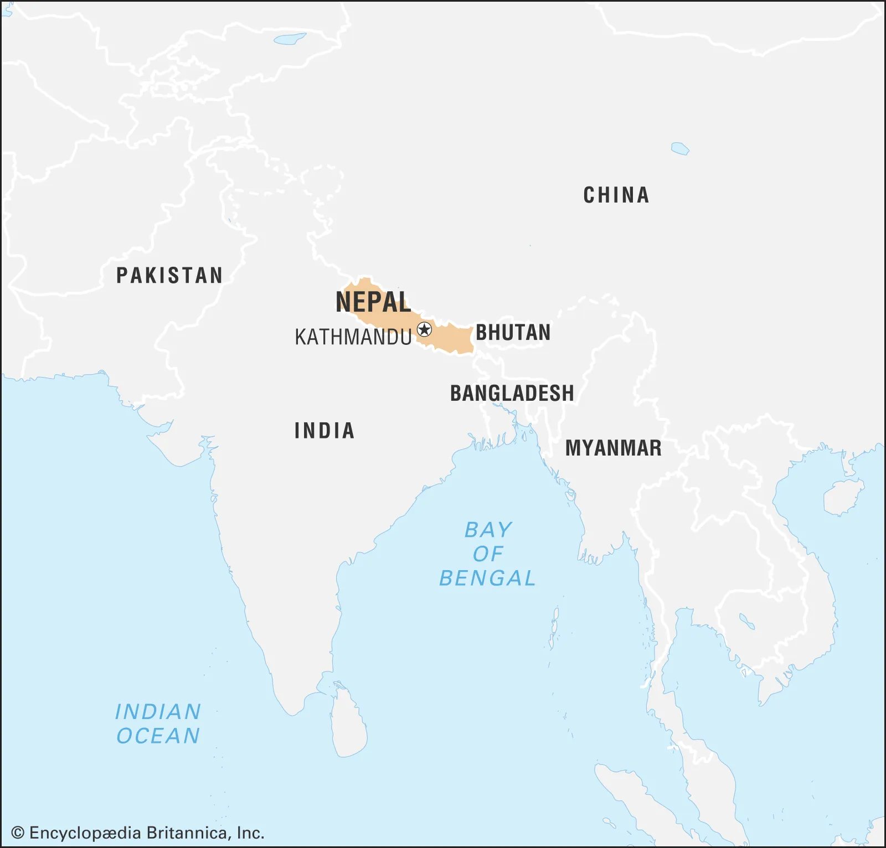
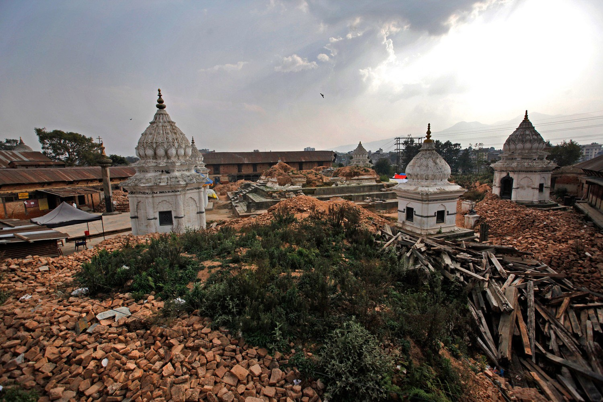
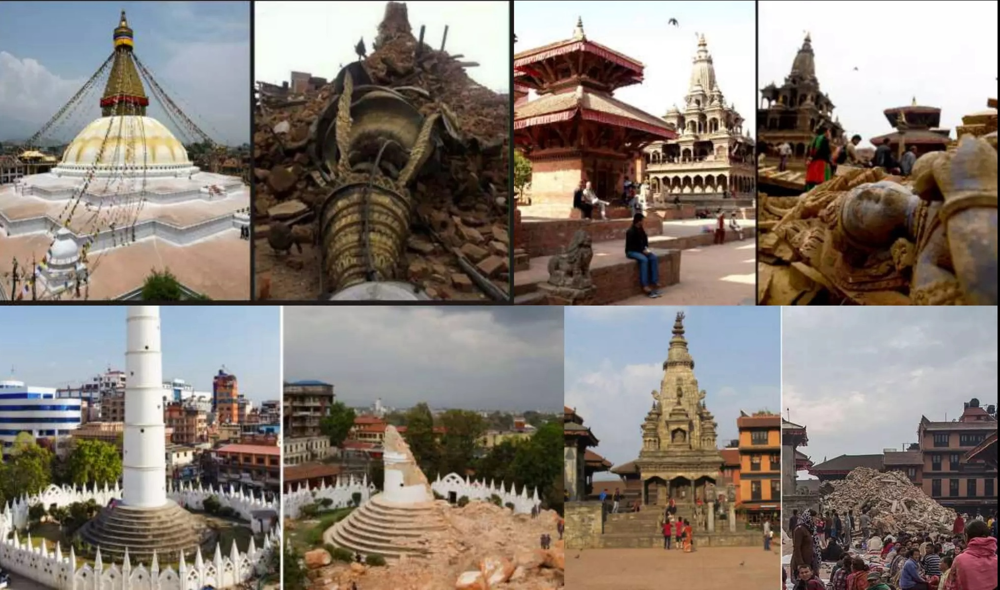
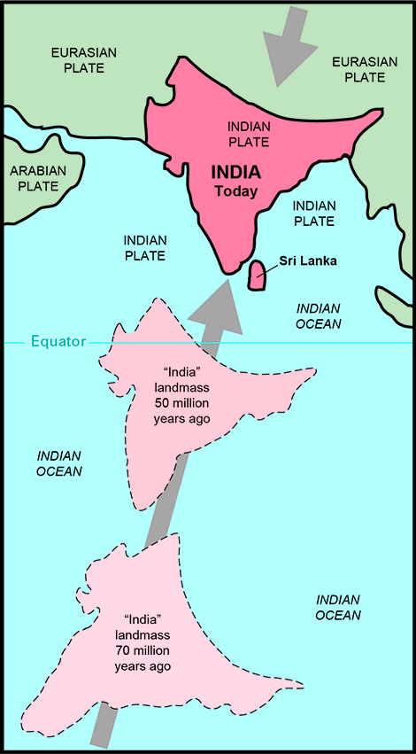
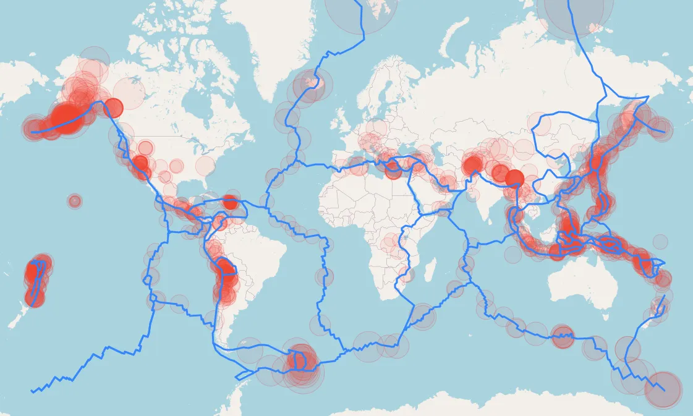

# Proyecto Earthquake (Earthquake Project)   

Este es el proyecto realizado como trabajo de calificación para KeepCoding®.  

## Uso:  

Clonar todo el repositorio, y descomprimir /data/archive.zip en su mismo directorio antes de usar el notebook para tener disponibles los datasets.  
Mantener la estructura del repositorio.

## MOTIVACIÓN:
* Aunque todo el mundo sabe lo que son los terremotos, nadie puede predecir con exactitud cuándo pasarán, o qué consecuencias tendrán, sólo se pueden hacer suposiciones
* aproximadas.  
* Este estudio surge para intentar ayudar a predecir y mitigar las consecuencias de uno de los efectos más devastadores de los seísmos para la humanidad: la destrucción
* de edificaciones, con la probabilidad de que suceda con sus habitantes dentro.
* Encontramos inspiración y punto de arranque del dataset en <a href="https://www.drivendata.org/competitions/57/nepal-earthquake/page/134/" style="text-decoration: underline">DrivenData</a>, sitio dedicado a promover competiciones de código para uso en proyectos  
de ayuda global reales a petición de diversas organizaciones. Esta competición está sin cerrar, por lo que no se ha proporcionado una solución para el proyecto que
hayamos podido usar aquí.

## ANTECEDENTES DEL ESTUDIO:
Nos baseremos en el <a href="https://es.wikipedia.org/wiki/Terremoto_de_Nepal_de_abril_de_2015" style="text-decoration: underline">Terremoto en Nepal en Abril de 2015:</a>  
\
</img>
\
\
En Abril del 2015 hubo un terremoto en Nepal de 7.8 en la escala de Richter, a 80 kms de la icónica Katmandú seguida de más de cien réplicas, y tres semanas después otro de 7.2 que terminó  
de asolar la región. Hubo unas 9000 víctimas mortales y casi 22000 heridos, además de muertes en India y en Tíbet.  
Usaremos este evento en concreto por ser el que tiene uno de los más grandes y mejor documentados <a href="https://github.com/TheBadBatchProjects/earthquakes/blob/main/data/archive.zip" style="text-decoration: underline">datasets</a> de análisis del mundo.  
Describe tanto las características de las construcciones previas al terremoto como su estado tras el seísmo, además de datos sociales y de impacto que pueden ser muy útiles tanto para análisis  
como para predicción.
\
\
 </img></img>
\
\
Es de sobra conocido que esa región se encuentra situada justo encima de la zona en la que la placa India se introduce bajo la placa Eurasiática, dando lugar a la cordillera del Tíbet y a  
las mayores montañas de la Tierra debido a la violencia del choque. Se prevée que la placa Índica acabará desapareciendo bajo la Eurasiática eventualmente, y además situada junto al  
"Cinturón de Fuego" del Pacífico, donde se encuentran al menos 6 placas, incluída la Indo-Australiana. Por lo tanto, tienen continuos seísmos, que podrían tener consecuencias como las  
ocurridas en este caso.  
A continuación podemos cer la placa Índica, y a la derecha la distribución de las placas de la Tierra y en puntos rojos representadas las intensidades y frecuencias de los seísmos catastróficos.

 </img></img>
\
\
Se puede observar que en todas las zonas de contacto de las placas tienen la misma ocurrencia de seísmos catastróficos, no son catástrofes exclusivas de una sola unión de placas, por lo que  
este modelo podría ayudar en cualquier parte del mundo con un simple ajuste de las características de las edificaciones y terrenos.
\
\
En toda la parte central y oriental del continente asiático son típicas y de uso masivo las construcciones con materiales baratos, y usando métodos de construcción con miles de años de  
antigüedad, como barro y paja, bambú, ladrillos sin cimientos, etc..., por lo que corren riesgos masivos de daños catastróficos materiales y humanos. De hecho, hay edificaciones Patrimonio  
de la Humanidad por su belleza, contenido cultural y gran antigüedad. Mucho de este mítico legado de la Humanidad fue destruído durante los seísmos. Dada la similitud de las construcciones  
en toda esa mitad del continente este modelo podría resultar de aplicación casi inmediata en cualquiera de esas regiones, como comienzo de un posible programa estándar de censado de edificios.  

## DESCRIPCIÓN DE LA TAREA Y ARQUITECTURA  
  
· Nuestra tarea será de clasificación multiclase, a predecir los grados de daño en los edificios.
· La ejecución del proyecto no estará a disposición del público general. Lo ejecutará este equipo bajo demanda o equipos locales preparados por nosotros.
· La arquitectura será muy sencilla, de ejecución "on promise" hasta que se consigan fondos por parte de las organizaciones locales para una ejecución basada en nubes. Una vez se ejecute en nube,  
  la arquitectura sólo contará con un bucket de almacenamiento tipo Google Drive/Storage, y de un servidor de notebooks tipo Colab conectado al almacenamiento. Ya que no es una tarea de necesidad  
  en tiempo real, la potencia básica de dichos servicios y la de los últimos euipos personales como los procesadores M de Apple serán suficientes.  
  Actualmente, los problemas con el rendimiento de las cuentas básicas de Google (en nuestro caso) no nos han permitido ejecutar adecuadamente en la nube nuestra tarea, pero mantenemos una Demo de  
  uso aquí:  
  https://colab.research.google.com/drive/1muaaQSZV4goolxsYSn08FyEQJgAHW1My?usp=sharing
· El pitch de nuestro proyecto es el Tableau que acompaña a este Readme y Notebook en este repositorio, "TABLEAU EARTHQUAKE.twbx"

Esperamos que les ilusione tanto el proyecto como a nosotros.
